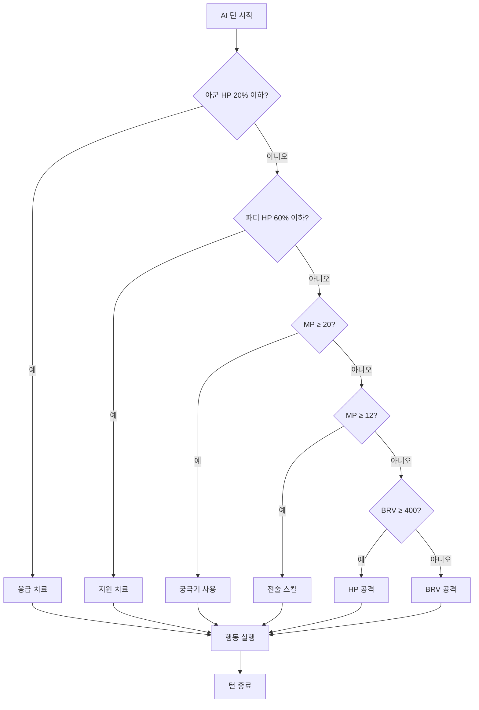

# 🤖 AI 게임 모드 완전 가이드

Dawn of Stellar의 AI 시스템은 지능적인 동료들과 함께 모험할 수 있는 혁신적인 시스템입니다.

## 🎮 AI 게임 모드 개요

### 기본 설정
- **기본 상태**: `ai_game_mode_enabled = False` (플레이어 직접 제어)
- **활성화**: 게임 내에서 AI 모드 토글 가능
- **제어 범위**: 플레이어 선택 캐릭터만 직접 조작, 나머지는 AI 자동 제어
- **학습 능력**: AI가 플레이어 패턴을 학습하고 적응

### AI 모드 특징
- **전략적 판단**: 상황 분석 후 최적 행동 선택
- **협력 플레이**: 플레이어와 협력하는 전술
- **적응형 AI**: 직업별 특성에 맞는 전문화된 AI
- **실시간 지원**: 전투 중 동적 역할 변경

## 🧠 AI 전술 시스템

### 전술적 우선순위 (Tactical Priority)
1. **emergency_heal** (응급 치료)
   - **조건**: HP 20% 이하인 아군 존재
   - **행동**: 즉시 가장 강력한 회복 스킬 사용
   - **우선순위**: 최고 (생존이 최우선)

2. **support_heal** (지원 치료)  
   - **조건**: 파티 전체 HP 60% 이하
   - **행동**: 파티 회복 또는 개별 치료
   - **우선순위**: 매우 높음 (파티 유지)

3. **ultimate_attack** (궁극기 공격)
   - **조건**: MP 20 이상 보유
   - **행동**: 상황에 맞는 궁극기 사용
   - **우선순위**: 높음 (결정적 순간)

4. **tactical_skill** (전술 스킬)
   - **조건**: MP 12 이상 보유
   - **행동**: 직업별 특수 스킬 사용
   - **우선순위**: 중간 (전술적 우위)

5. **hp_attack** (HP 공격)
   - **조건**: BRV 400 이상 보유
   - **행동**: BRV를 소모한 직접 피해
   - **우선순위**: 낮음 (마무리용)

6. **brv_attack** (BRV 공격)
   - **조건**: 다른 행동 불가능할 때
   - **행동**: 기본 BRV 공격 (MP 0)
   - **우선순위**: 최하 (기본 행동)

### AI 의사결정 플로우차트


## 👥 AI 동료 시스템

### 캐릭터 성별 시스템
- **남성 캐릭터**: 120개 이상의 다양한 이름
- **여성 캐릭터**: 125개 이상의 다양한 이름
- **성별별 특성**: 대화 스타일 및 상호작용 차이

### 성격 시스템 (CharacterPersonality)
1. **CHEERFUL** (쾌활함)
   - **특징**: 밝고 긍정적, 팀 분위기 메이커
   - **대화**: "안녕! 오늘도 신나는 하루야!", "와! 뭔가 재밌는 일이 생길 것 같아!"
   - **전투**: 공격적이고 적극적인 스타일

2. **SERIOUS** (진지함)
   - **특징**: 냉정하고 계획적, 전략적 사고
   - **대화**: "상황을 분석해보자.", "신중하게 접근해야 한다."
   - **전투**: 방어적이고 안정적인 스타일

3. **GENTLE** (온화함)
   - **특징**: 친절하고 배려심 많음, 치유 역할
   - **대화**: "괜찮아, 함께 해결해보자.", "모두 안전하게 지키겠어."
   - **전투**: 지원 및 회복 위주

4. **COLD** (냉정함)
   - **특징**: 감정 표현 적음, 효율성 중시
   - **대화**: "...알겠다.", "불필요한 대화는 생략하자."
   - **전투**: 계산적이고 정확한 공격

5. **PLAYFUL** (장난기)
   - **특징**: 활발하고 장난스러움, 예측 불가
   - **대화**: "이것도 재밌겠는데?", "한 번 해볼까?"
   - **전투**: 창의적이고 변칙적인 스타일

6. **MYSTERIOUS** (신비로움)
   - **특징**: 과묵하고 수수께끼 같음
   - **대화**: "흥미롭군...", "그럴 수도 있겠지."
   - **전투**: 예측하기 어려운 스킬 선택

7. **HOT_TEMPERED** (성급함)
   - **특징**: 화를 잘 내고 성격이 급함
   - **대화**: "빨리 가자!", "답답해 죽겠어!"
   - **전투**: 공격적이고 즉흥적인 스타일

8. **WISE** (현명함)
   - **특징**: 지혜롭고 침착함, 조언자 역할
   - **대화**: "경험상 이런 경우는...", "지혜롭게 판단하자."
   - **전투**: 상황에 맞는 최적 선택

9. **BALANCED** (균형잡힌)
   - **특징**: 중도적이고 안정적, 기본 성격
   - **대화**: "그렇게 하는 게 좋겠다.", "함께 가자."
   - **전투**: 상황에 따른 유연한 대응

### AI 요청 시스템 (AIRequest)
- **아이템 요청**: 필요한 아이템 공유 요청
- **전술 제안**: 전투 전략 제안
- **경고 알림**: 위험 상황 경고
- **도움 요청**: 특별한 도움이 필요한 상황

## 🎯 직업별 AI 특성

### 🛡️ 탱커 역할 (전사, 성기사)
- **우선순위**: 파티 보호 > 어그로 유지 > 공격
- **행동 패턴**: 적극적인 방어, 도발 스킬 활용
- **판단 기준**: 아군 위험도 > 자신의 안전

### ⚔️ 딜러 역할 (아크메이지, 궁수, 도적)
- **우선순위**: 최대 DPS > 생존 > 지원
- **행동 패턴**: 강력한 공격 스킬 우선 사용
- **판단 기준**: 피해량 효율성 > MP 효율성

### 💚 힐러 역할 (성기사, 신관, 드루이드)
- **우선순위**: 아군 생존 > 디버프 > 공격
- **행동 패턴**: 체력 모니터링, 예방적 치료
- **판단 기준**: 파티 전체 HP > 개인 기여도

### 🎭 서포터 역할 (바드, 무당, 연금술사)
- **우선순위**: 파티 버프 > 적 디버프 > 공격
- **행동 패턴**: 상황 분석 후 최적 지원
- **판단 기준**: 파티 시너지 > 즉시 효과

## 🔧 AI 설정 및 조작

### AI 모드 활성화
1. **게임 중 활성화**: 메뉴에서 "AI 모드 토글" 선택
2. **개별 설정**: 캐릭터별로 AI 활성화/비활성화 가능
3. **전투 중 변경**: 전투 중에도 AI 모드 전환 가능
4. **저장 연동**: AI 설정은 세이브 파일에 저장

### AI 행동 커스터마이징
- **공격성 조절**: 보수적 ↔ 공격적
- **MP 사용 패턴**: 절약형 ↔ 적극형
- **역할 우선순위**: 개인 생존 ↔ 팀 기여
- **스킬 선호도**: 안전한 스킬 ↔ 위험한 스킬

### AI 학습 시스템
- **플레이어 패턴 분석**: 자주 사용하는 전술 학습
- **상황별 대응**: 특정 상황에서의 선호 행동 기억
- **효율성 학습**: 성공률 높은 행동 패턴 강화
- **적응형 개선**: 실패 패턴 회피 학습

## 💬 대화 시스템

### 성격별 대화 특성
각 AI 동료는 자신의 성격에 맞는 고유한 대화 스타일을 가집니다:

#### 쾌활한 캐릭터 (CHEERFUL)
```
인사: "안녕! 오늘도 신나는 하루야!"
전투: "우리가 이길 거야! 힘내!"
승리: "역시 우리가 최고야!"
```

#### 진지한 캐릭터 (SERIOUS)  
```
인사: "상황을 분석해보자."
전투: "신중하게 접근하자."
승리: "계획대로 진행되었다."
```

### 상호작용 시스템
- **상황 반응**: 전투, 탐험, 휴식 등 상황별 다른 반응
- **관계 발전**: 함께한 시간에 따른 대화 변화
- **기분 상태**: 전투 결과나 상황에 따른 기분 변화
- **개인적 대화**: 각 캐릭터의 배경 스토리 공개

## 📊 AI 성능 분석

### AI 효율성 지표
- **생존률**: AI 제어 캐릭터의 생존율
- **DPS 기여도**: 전체 데미지에서 AI의 기여분
- **지원 효과**: 힐링 및 버프 효율성
- **MP 효율성**: MP 사용의 최적화 정도

### 성능 모니터링
- **실시간 분석**: 전투 중 AI 성능 실시간 표시
- **전투 후 리포트**: 각 AI의 기여도 분석
- **장기 통계**: 시간에 따른 AI 성능 변화
- **비교 분석**: 플레이어 vs AI 성능 비교

## 🛠️ 개발자 정보

### AI 알고리즘
- **의사결정 트리**: 상황별 최적 행동 선택
- **가중치 시스템**: 행동별 우선순위 계산
- **상황 분석**: 전장 상태 및 파티 상태 분석
- **예측 모델**: 행동 결과 예측 및 평가

### 디버그 기능
- **AI 로직 표시**: AI 의사결정 과정 실시간 표시
- **행동 로그**: AI 행동 기록 및 분석
- **성능 측정**: AI 반응 속도 및 정확도 측정
- **강제 제어**: 개발자 모드에서 AI 강제 제어

### 설정 파일
```python
# config.py
AI_SETTINGS = {
    "default_enabled": False,
    "learning_rate": 0.1,
    "personality_variance": 0.3,
    "response_time": 1.0
}
```

## 📸 스크린샷


## 🎮 플레이 팁

### AI와 협력하는 방법
1. **역할 분담**: 각 캐릭터의 역할을 명확히 하기
2. **의사소통**: AI 요청사항 적극 반영하기
3. **신뢰**: AI의 판단을 믿고 맡기기
4. **학습**: AI가 학습할 수 있도록 일관된 플레이

### AI 모드 활용 상황
- **학습 단계**: 게임을 배우는 초보자
- **편의성**: 복잡한 파티 관리를 자동화하고 싶을 때
- **실험**: 다양한 전술을 AI와 함께 시도
- **스토리**: AI 동료들과의 상호작용을 즐기고 싶을 때

이 AI 시스템을 통해 혼자서도 완전한 파티플레이를 경험할 수 있습니다!
