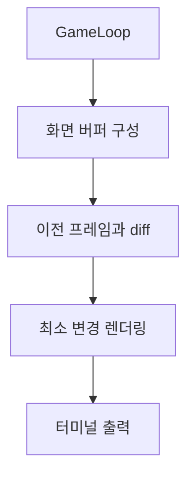

# Audio & UI/Display

## Audio
- pygame.mixer
- BGMType별 볼륨 스케일링으로 화면 전환 시 볼륨 스파이크 방지

## UI/Display
- GameDisplay: 맵/파티/정보 표시
- BufferedDisplay 통합(필드/전투)로 부드러운 갱신
- 입력: UnifiedInputManager/KeyboardInput, 홀드/버스트 디바운스, 블로킹 키 입력

## 렌더링 흐름

## 스크린샷

