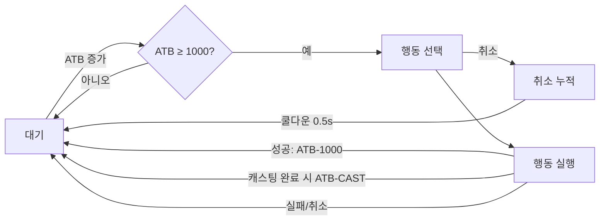

# ⚔️ 전투 시스템 완전 가이드

Dawn of Stellar의 전투 시스템은 **ATB (Active Time Battle)**와 **Brave 시스템**이 융합된 혁신적인 전투 메커니즘입니다.

## 🕰️ ATB (Active Time Battle) 시스템

### 기본 메커니즘
- **ATB 범위**: 0 ~ 2000 (ATB_MAX = 2000)
- **행동 임계값**: 1000 (ATB_READY_THRESHOLD = 1000)
- **행동 비용**: 행동 후 ATB 1000 차감
- **애니메이션**: 60FPS 부드러운 실시간 게이지

### ATB 증가 시스템
```
기본_증가량 = 50
실제_증가량 = 기본_증가량 × (캐릭터_속도 / 100)
최소_증가량 = 25 (속도가 50 이하일 때)
최대_증가량 = 100 (속도가 200 이상일 때)
```

### 턴 순서 결정
1. **ATB 게이지 >= 1000**: 행동 가능 상태
2. **우선순위**: ATB 게이지 > 속도 > 무작위
3. **공정성**: `get_action_order()`로 단일 우선순위 기반 선택
4. **행동 완료**: 실제 행동한 경우에만 ATB 1000 차감

## ⚡ Brave 시스템 (FF 스타일)

### BRV (Brave) 포인트
- **기능**: HP 공격의 위력을 결정하는 포인트
- **획득**: BRV 공격으로 적의 BRV를 빼앗아 자신의 BRV 증가
- **소모**: HP 공격 시 자신의 BRV를 소모하여 적에게 실제 피해
- **INT BRV**: 턴 시작 시 기본 BRV로 회복 (Initial Brave)

### BREAK 시스템
- **발생 조건**: BRV가 0이 되었을 때
- **효과**: 
  - ATB 게이지 0으로 리셋
  - 다음 턴까지 행동 불가
  - 상대방에게 BRV 보너스 제공
- **해제**: 턴이 돌아올 때 INT BRV로 회복

### BRV 보정 시스템
- **직업별 BRV 보너스**: 각 직업마다 고유한 BRV 계수
- **장비 BRV 보너스**: 무기/방어구를 통한 추가 BRV
- **상태이상 영향**: 축복/저주 등이 BRV에 영향

## 🩹 상처 시스템 (Wound System)

### 상처 메커니즘
- **상처 축적**: 받은 피해의 25%가 상처로 누적
- **최대 상처**: 최대 HP의 75%까지 제한
- **영구성**: 상처는 전투 종료 후에도 지속
- **표시**: `현재HP/최대HP (상처: X)`

### 상처 치유
- **치유 조건**: 초과 회복량의 25%가 상처 치료에 사용
- **예시**: HP가 이미 가득 찬 상태에서 100 회복 → 상처 25 치유
- **완전 치유**: 상처를 모두 없애려면 상처량의 4배 회복 필요

### 상처 영향
- **실질적 최대 HP 감소**: 상처만큼 최대 HP가 줄어든 것과 같은 효과
- **치유 효율성 저하**: 단순 회복으로는 완전한 치유 불가능
- **전략적 요소**: 장기전에서 매우 중요한 요소

## 🎯 스킬 시스템 통합

### 스킬 타입
1. **BRV_ATTACK**: Brave 포인트 획득 공격 (MP 0)
2. **HP_ATTACK**: 직접 HP 피해 공격 (MP 0) 
3. **BRV_HP_ATTACK**: BRV 획득 + HP 피해 복합
4. **ULTIMATE**: 궁극기 (높은 MP 소모)
5. **SUPPORT**: 지원/회복 스킬
6. **DEBUFF**: 적 약화 스킬

### 캐스팅 시스템
- **캐스트 타임**: 스킬별 시전 시간 (0.5초~3초)
- **중단 가능**: 피해 받으면 캐스팅 중단
- **ATB 연동**: 캐스팅 중 ATB 게이지 표시
- **즉시 시전**: MP 0 기본 공격은 즉시 실행
- **캐스팅 완료**: 완료 시에만 `cast_time`만큼 ATB 차감

## 🛡️ 통합 데미지 시스템

### 데미지 계산
```
기본_피해 = (공격력 / 방어력) × 스킬_배율
최종_피해 = 기본_피해 × 특성_배율 × 상태_배율
BRV_피해 = 최종_피해 × BRV_배율 (BRV 공격)
HP_피해 = BRV_포인트 × HP_배율 (HP 공격)
```

### 방어력 시스템
- **물리 방어**: 물리 공격에 대한 저항
- **마법 방어**: 마법 공격에 대한 저항  
- **통합 계산**: 물리/마법 피해 계산 통합
- **관통**: 일부 공격은 방어력 무시

### 크리티컬 시스템
- **크리티컬 확률**: 기본 5% + 운 스탯 + 직업 보정
- **크리티컬 배율**: 1.5배 ~ 2.0배
- **추가 효과**: 크리티컬 시 상태이상 부여 가능

## 🎭 상성 시스템

### 직업간 상성
- **탱커 vs 딜러**: 상성 보너스/페널티
- **물리 vs 마법**: 서로 다른 저항 메커니즘
- **특수 직업**: 고유한 상성 관계

### 원소 시스템
- **원소 타입**: 화염, 빙결, 번개, 어둠, 빛 등
- **저항/약점**: 원소별 저항도 및 약점
- **원소 융합**: 복합 원소 공격

## 🤖 AI 전투 시스템

### AI 우선순위 (전술적)
1. **emergency_heal**: 응급 치료 (HP 20% 이하)
2. **support_heal**: 지원 치료 (파티 HP 60% 이하)  
3. **ultimate_attack**: 궁극기 사용 (MP 20 이상)
4. **tactical_skill**: 전술 스킬 (MP 12 이상)
5. **hp_attack**: HP 공격 (BRV 400 이상)
6. **brv_attack**: BRV 공격 (기본 행동)

### AI 특성
- **적응형 AI**: 상황에 따른 전략 변경
- **협력 전술**: 파티원과의 연계 공격
- **학습 능력**: 플레이 패턴 분석 및 대응
- **직업별 전문화**: 각 직업의 특성에 맞는 AI

## 🛠️ 특수 메커니즘

### 그림자 시스템 (암살자)
- **그림자 생성**: 공격 시 그림자 소환
- **그림자 메아리**: 추가 피해 효과
- **그림자 처형**: 모든 그림자 소모 강력한 일격

### 맹독 시스템 (도적)
- **독 중첩**: 최대 96스택까지 독 누적
- **독 촉진**: HP 공격 시 독 피해 즉시 적용
- **독 면역**: 특정 조건에서 독 면역 획득

### 조준 시스템 (궁수)
- **조준 포인트**: 공격마다 조준 정확도 증가
- **지원사격**: 턴 종료 시 추가 공격
- **관통 공격**: 여러 적에게 동시 피해

### 음표 시스템 (바드)
- **음표 중첩**: 파티 버프 효과 누적
- **사기 시스템**: 파티 전체의 능력치 증가
- **음파 공격**: 음악을 통한 범위 공격

## 📊 전투 밸런스

### 밸런스 원칙
- **공정성**: 운보다는 전략과 실력 중심
- **다양성**: 여러 전술의 유효성 보장
- **진입 장벽**: 초보자도 쉽게 시작 가능
- **숙련도**: 마스터하기 어려운 깊이

### 난이도 조정
- **평온**: 피해 -40%, 경험치 +20%
- **보통**: 표준 밸런스
- **어려움**: 피해 +50%, 경험치 +50%
- **지옥**: 피해 +100%, 특수 보상

## 🎮 전투 UI

### 게이지 시스템
- **HP 게이지**: 현재 HP/최대 HP + 상처 표시
- **MP 게이지**: 현재 MP/최대 MP
- **BRV 게이지**: 현재 BRV + INT BRV 표시
- **ATB 게이지**: 실시간 애니메이션, 60FPS

### 상태 표시
- **상태이상**: 아이콘과 지속 시간 표시
- **버프/디버프**: 색상으로 구분
- **캐스팅**: 진행률과 남은 시간 표시
- **BREAK 상태**: 특별한 표시와 경고

### 전투 로그
- **실시간 로그**: 모든 행동과 결과 기록
- **데미지 표시**: 타입별 색상 구분
- **효과 알림**: 상태 변화 및 특수 효과
- **턴 순서**: 다음 행동자 예고

## 🔧 턴 시스템 상세

### 플레이어 턴 (player_turn)
```python
# 실제 행동 시에만 "action_completed" 반환
if 행동_성공:
    return "action_completed"  # → ATB 1000 차감
else:
    return None  # → ATB 유지, 스팸 방지
```

### 취소 시스템
- **취소 누적**: 연속 취소 2회 이상 시 쿨다운 0.5초
- **후보 제외**: 쿨다운 중 턴 순서에서 제외
- **스팸 방지**: 무한 취소 방지 메커니즘

### 전투 흐름도


## 🔧 개발자 정보

### 핵심 상수
```python
ATB_MAX = 2000
ATB_READY_THRESHOLD = 1000
action_cost = 1000  # 기본 행동 비용
```

### 디버그 기능
- **전투 로그**: 상세한 전투 데이터 기록
- **밸런스 테스트**: 실시간 데미지 분석
- **AI 로직**: AI 의사결정 과정 표시
- **성능 모니터링**: 전투 중 성능 측정

### 설정 옵션
- **애니메이션 속도**: 게이지 애니메이션 조정
- **자동 전투**: AI 자동 전투 모드
- **전투 속도**: 전투 진행 속도 조정
- **시각 효과**: 전투 이펙트 on/off

## 📸 스크린샷


이 전투 시스템은 전략적 깊이와 실시간 액션이 균형을 이룬 혁신적인 시스템입니다!
