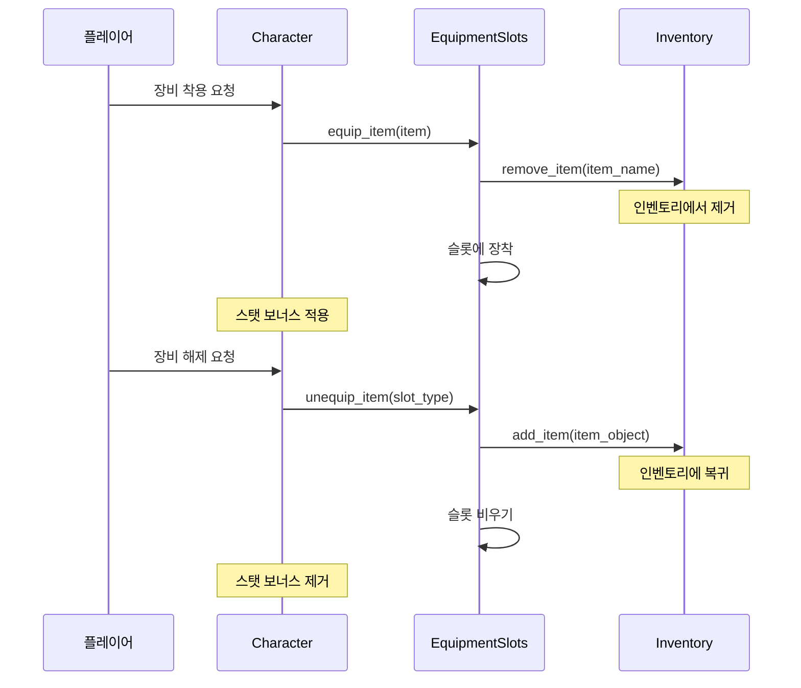

# 🎒 인벤토리 & 장비 시스템 완전 가이드

Dawn of Stellar의 인벤토리와 장비 시스템은 복잡하면서도 직관적인 아이템 관리를 제공합니다.

## 📦 인벤토리 시스템 (Inventory)

### 기본 구조
- **무제한 슬롯**: 기본적으로 슬롯 제한 없음
- **무게 시스템**: 총 무게 제한으로 휴대량 조절
- **카테고리 분류**: 아이템 타입별 자동 분류
- **자동 정렬**: 이름순, 타입순, 희귀도순 정렬 가능

### 아이템 추가 시스템
```python
# 안전한 아이템 추가 (권장)
inventory.add_item_by_name(item_name, quantity)
# DB 조회 후 Item 객체 생성하여 추가

# 직접 아이템 추가 (고급)  
inventory.add_item(item_object, quantity)
# Item 객체가 이미 있을 때 사용
```

### 무게 관리 시스템
- **총 무게**: `get_total_weight()` - 현재 총 무게
- **무게 비율**: `get_weight_ratio()` - 최대 대비 현재 비율
- **무게 제한**: 초과 시 이동 속도 감소 페널티
- **가방 업그레이드**: 더 큰 가방으로 무게 한도 증가

### 아이템 카테고리
1. **무기** (Weapons)
   - 한손검, 양손검, 활, 지팡이, 단검 등
   - 공격력, 크리티컬, 특수 효과

2. **방어구** (Armor)
   - 투구, 갑옷, 장갑, 신발
   - 방어력, 마법저항, 세트 효과

3. **액세서리** (Accessories)
   - 반지, 목걸이, 귀걸이, 부적
   - 특수 능력, 상태저항, 보너스 스탯

4. **소모품** (Consumables)
   - 포션, 음식, 스크롤
   - 즉시 사용 또는 전투 중 사용

5. **재료** (Materials)
   - 제작 재료, 강화 석, 보석
   - 제작 및 강화 시스템에 사용

6. **귀중품** (Valuables)
   - 퀘스트 아이템, 수집품, 열쇠
   - 특별한 용도나 높은 판매가

## ⚔️ 장비 시스템 (Equipment)

### 장비 슬롯
```
┌─────────────────┐
│    [무기]        │
├─────────────────┤
│    [방어구]      │
├─────────────────┤
│   [액세서리]     │
└─────────────────┘
```

**실제 장비 시스템**: Dawn of Stellar는 3가지 기본 장비 슬롯을 사용합니다.
- **무기** (equipped_weapon): 주 공격 도구
- **방어구** (equipped_armor): 방어력 제공
- **액세서리** (equipped_accessory): 특수 효과 제공

### 내구도 시스템
- **최대 내구도**: 장비별 고정값
- **현재 내구도**: 사용에 따라 감소
- **내구도 손실**: 전투, 특정 스킬 사용 시 감소
- **파손 효과**: 내구도 0일 때 효과 완전 상실
- **수리 시스템**: NPC 수리 또는 수리 키트 사용

### 장비 효과 계산
```python
# 내구도에 따른 효과 감소
effective_bonus = base_bonus * (current_durability / max_durability)

# 완전 파손 시 효과 없음
if current_durability <= 0:
    effective_bonus = 0
```

### 장착/해제 시스템


## 🔧 장비 강화 시스템

### 강화 단계
**⚠️ 현재 시스템 상태**: 장비 강화 시스템은 내부적으로 구현되어 있지만 플레이어에게 직접 노출되지 않습니다.

- **+0 ~ +15**: 기본 강화 범위 (코드에서 `max_enhancement = 15`)
- **Enhancement Level**: 각 장비마다 `enhancement_level` 속성 보유
- **AI 추천**: AI 시스템에서 장비 강화 추천 기능 제공

### 내부 구현 상태
```python
# Equipment 클래스에서
self.enhancement_level = 0      # 현재 강화 단계
self.max_enhancement = 15       # 최대 강화 한계
```

### 향후 구현 예정
- **플레이어 UI**: 강화 인터페이스 추가 필요
- **강화 재료**: 아이템 시스템과 연동 예정
- **성공률 시스템**: 단계별 성공률 계산 로직
- **강화 비용**: 골드 및 재료 소모 시스템

## 💎 희귀도 & 특수 옵션 시스템

### 희귀도 등급 (현재 구현됨)
1. **일반** (Common) - 회색 ⚪
   - 기본적인 능력치
   - 쉽게 획득 가능

2. **고급** (Rare) - 파란색 🔵
   - 향상된 능력치
   - 1-2개 특수 옵션 (구현 예정)

3. **영웅** (Epic) - 보라색 🟣
   - 높은 능력치
   - 2-3개 특수 옵션 (구현 예정)

4. **전설** (Legendary) - 주황색 🟠
   - 매우 높은 능력치
   - 3-4개 특수 옵션 (구현 예정)
   - 고유한 특수 능력

5. **신화** (Mythic) - 빨간색 🔴
   - 최고 등급 능력치
   - 4-5개 특수 옵션 (구현 예정)
   - 세트 효과 가능

### 특수 옵션 시스템 (✅ 구현 완료!)

**🎉 새로운 특수 옵션 시스템이 완전히 구현되었습니다!**
희귀도에 따라 자동으로 특수 옵션이 생성되며, 각 장비마다 고유한 능력을 가집니다.

#### 희귀도별 옵션 개수
- **일반 (Common)**: 특수 옵션 없음
- **고급 (Uncommon)**: 1-2개 기본 옵션
- **희귀 (Rare)**: 2-3개 향상된 옵션  
- **영웅 (Epic)**: 3-4개 강력한 옵션
- **전설 (Legendary)**: 4-5개 최고급 옵션
- **신화 (Mythic)**: 5-6개 특별 옵션
- **유니크 (Unique)**: 3-5개 고유 옵션

#### 기본 스탯 증가 옵션 (모든 희귀도)
- **공격력 +5~25%**: 물리 공격력 퍼센트 증가
- **마법력 +5~25%**: 마법 공격력 퍼센트 증가  
- **방어력 +5~20%**: 물리 방어력 퍼센트 증가
- **생명력 +3~15%**: 최대 HP 퍼센트 증가
- **마나 +5~20%**: 최대 MP 퍼센트 증가
- **속도 +3~15%**: 행동 속도 퍼센트 증가

#### 전투 효과 옵션 (Rare 이상)
- **치명타 확률 +2~15%**: 크리티컬 확률 증가
- **치명타 피해 +10~50%**: 크리티컬 피해 배율 증가
- **회피율 +3~20%**: 공격 회피 확률 증가
- **막기 확률 +5~25%**: 공격 차단 확률 증가  
- **흡혈 1~8%**: 가한 피해의 일정 비율만큼 HP 회복

#### 원소 효과 옵션 (Epic 이상)
- **화염/냉기/번개/대지 피해 +10~30**: 추가 원소 피해
- **화염/냉기/번개/대지 저항 +5~30%**: 해당 원소 저항력
- **원소 공격**: 공격 시 상태이상 부여 (화상, 냉기, 감전 등)

#### 스킬 관련 옵션 (Legendary 이상)
- **스킬 쿨다운 -5~25%**: 스킬 재사용 시간 감소
- **마나 소모 -5~20%**: 스킬 마나 비용 감소
- **시전 속도 +10~40%**: 스킬 시전 시간 단축

#### 특별 효과 옵션 (Mythic/Unique)
- **경험치 +10~50%**: 획득 경험치 증가
- **골드 +15~60%**: 획득 골드 증가  
- **아이템 드롭률 +5~25%**: 아이템 드롭 확률 증가
- **행운 +1~10**: 모든 확률 관련 수치 증가
- **자가 수리 1~5%**: 턴마다 내구도 자동 회복 (30% 확률)
- **내구도 +20~100%**: 최대 내구도 증가

#### 특수 옵션 발동 시스템
```python
# 장비 착용 시 자동 적용
equipment = create_equipment("강철검")
# 자동으로 희귀도에 맞는 특수 옵션 생성

# 옵션 확인
for effect in equipment.special_effects:
    print(f"• {effect.description}")
    if effect.proc_chance < 1.0:
        print(f"  ({int(effect.proc_chance*100)}% 확률)")
```

#### 세이브/로드 호환성
- **완전 호환**: 기존 세이브 파일과 100% 호환
- **자동 업그레이드**: 로드 시 특수 옵션 자동 적용
- **안전한 저장**: 모든 옵션 정보가 안전하게 저장됨

#### 특수 능력 옵션
- **뱀파이어**: 공격 시 HP 회복
- **마나 흡수**: 공격 시 MP 회복
- **광전사**: HP 낮을수록 공격력 증가
- **재생**: 턴마다 HP 자동 회복
- **집중**: 연속 공격 시 피해량 증가
- **반격자**: 공격받을 때 강력한 반격


## 💾 저장/로드 무결성

### 안전한 저장 시스템
```python
# GameStateSerializer 사용 (권장)
serializer = GameStateSerializer()
save_data = serializer.serialize_game_state(character, party, world)

# 장비와 인벤토리 동기화 보장
serializer.ensure_equipment_inventory_sync()
```

### 로드 시 무결성 검사
- **장비 유효성**: 존재하지 않는 장비 자동 제거
- **인벤토리 복구**: 장착된 장비가 인벤토리에 중복 존재하지 않도록 검사
- **Item 객체 변환**: 문자열 데이터를 Item 객체로 안전하게 변환
- **오류 복구**: 데이터 불일치 시 자동 복구 시도

### 백업 시스템
- **자동 백업**: 게임 종료 시 자동 백업 생성
- **다중 슬롯**: 최대 10개 저장 슬롯 지원  
- **버전 호환성**: 구 버전 세이브 파일 자동 변환
- **손상 복구**: 손상된 세이브 파일 복구 시도

## 🛡️ AI 자동 장비 관리

### BasicEquipmentManager
- **자동 최적화**: 현재 스탯에 최적인 장비 자동 선택
- **안전한 교체**: 아이템 소실 방지 메커니즘
- **효율성 계산**: 장비 조합의 시너지 고려
- **예외 처리**: 장착 불가능한 장비 자동 제외

### 자동 관리 알고리즘
```python
def auto_optimize_equipment():
    # 1. 현재 장착 장비 분석
    current_performance = calculate_performance()
    
    # 2. 가능한 조합 시뮬레이션
    best_combination = find_best_equipment_combination()
    
    # 3. 개선된 조합이 있으면 교체
    if best_combination.performance > current_performance:
        safely_replace_equipment(best_combination)
```

## 🎮 사용자 인터페이스

### 인벤토리 UI
- **그리드 뷰**: 아이콘 기반 시각적 인터페이스
- **리스트 뷰**: 텍스트 기반 상세 정보 표시
- **필터링**: 카테고리별, 희귀도별 필터
- **검색**: 아이템 이름으로 빠른 검색
- **정렬**: 다양한 기준으로 정렬 가능

### 장비 UI
- **장비창**: 현재 장착 장비 시각적 표시
- **비교**: 장착 예정 장비와 현재 장비 비교
- **세트 표시**: 세트 장비 효과 실시간 표시
- **내구도 경고**: 내구도 낮은 장비 자동 알림

### 단축키
- **I**: 인벤토리 열기/닫기
- **P**: 파티 상태 (장비 정보 포함)
- **F**: 필드 활동 (요리, 스킬, 상인)
- **B**: 게임 저장
- **H**: 도움말

## 🍳 요리 시스템 (Cooking System)

### 요리 시스템 개요
Dawn of Stellar의 요리 시스템은 단순한 회복 아이템 제작을 넘어서 **최대 HP 증가**, **상처 치료**, **BRV 시스템 연동** 등 전략적 깊이를 제공합니다.

### 접근 방법
- **필드 활동**: `F` 키 → "🍳 야외 요리 & 채집" 선택
- **요리 메뉴**: "🍳 요리 시스템" 선택
- **채집 활동**: "🌿 채집하기"로 재료 수집

### 식재료 시스템

#### 식재료 타입 (IngredientType)
1. **고기류** (MEAT) 🥩
   - 높은 체력 회복 효과
   - 물리 공격력 증가 버프

2. **해산물** (SEAFOOD) 🐟
   - 마나 회복 효과
   - 마법 공격력 증가 버프

3. **채소류** (VEGETABLE) 🥕
   - 균형잡힌 영양소
   - 방어력 증가 효과

4. **과일류** (FRUIT) 🍎
   - 빠른 회복 효과
   - 상태이상 저항 증가

5. **곡물류** (GRAIN) 🌾
   - 지속적인 포만감
   - 스태미나 회복

6. **약초류** (HERB) 🌿
   - 상처 치료 효과
   - 특수 상태 회복

7. **향신료** (SPICE) 🌶️
   - 요리 효과 증폭
   - 특수 버프 효과

8. **액체류** (LIQUID) 💧
   - 요리 필수 재료
   - 갈증 해소

9. **특수재료** (SPECIAL) ✨
   - 희귀한 효과
   - 고급 요리 전용

### 희귀도 시스템
- **1등급** (흔함): 기본 재료, 쉽게 구할 수 있음
- **2등급** (일반): 약간의 특수 효과
- **3등급** (희귀): 좋은 효과의 재료
- **4등급** (매우 희귀): 강력한 효과
- **5등급** (전설): 최고 등급 재료, 극히 드묾

### 요리 효과

#### 기본 효과
- **체력 회복**: 즉시 HP 회복
- **마나 회복**: 즉시 MP 회복
- **포만감**: 일정 시간 자동 회복

#### 고급 효과
- **최대 HP 증가**: 영구적인 체력 상한선 증가
- **상처 치료**: 상처 시스템의 누적 상처 치료
- **BRV 보너스**: INT BRV 및 MAX BRV 증가
- **특수 버프**: 임시 능력치 증가

#### 영구 진행 효과
- **요리 숙련도**: 요리할수록 성공률 증가
- **레시피 발견**: 새로운 조합 발견
- **특화 요리사**: 특정 타입 요리 전문가로 성장

### 요리 제작 과정

#### 1단계: 재료 준비
```
필요 재료 확인 → 인벤토리에서 재료 소모 → 요리 시작
```

#### 2단계: 요리 실행
```
레시피 선택 → 제작 확률 계산 → 성공/실패 판정 → 결과물 획득
```

#### 3단계: 효과 적용
```
음식 섭취 → 즉시 효과 적용 → 지속 효과 활성화 → 숙련도 증가
```

### 특수 레시피 예시

#### 🍖 고급 스테이크
- **재료**: 고급 고기 + 향신료 + 기름
- **효과**: HP 50 회복 + 공격력 20% 증가 (30분)
- **특수**: 최대 HP +5 영구 증가 (1회 한정)

#### 🍲 회복의 수프
- **재료**: 약초 + 채소 + 맑은 물
- **효과**: 상처 25 치료 + 독/화상 상태 해제
- **특수**: 30분간 상태이상 면역

#### 🍯 마력 회복 차
- **재료**: 마나 허브 + 꿀 + 끓인 물  
- **효과**: MP 전체 회복 + INT BRV +50 (60분)
- **특수**: 마법 사용 시 MP 소모 -20% (30분)

### 채집 시스템

#### 채집지 정보
- **숲**: 약초류, 과일류, 목재 등
- **강가**: 해산물, 물, 특수 광물
- **들판**: 곡물류, 채소류, 향신료
- **동굴**: 희귀 재료, 특수 광물, 버섯류

#### 채집 성공률
```
기본 성공률 + 캐릭터 능력 + 도구 보너스 = 최종 성공률
```

#### 채집 시스템 (현재 상태)
**⚠️ 구현 상태**: 기본 채집 시스템만 구현됨

- **기본 채집**: 손으로 직접 채집 (확률 기반)
- **적 드롭**: 특정 몬스터에서 재료 획득
- **환경 채집**: 던전 내 환경에서 재료 발견

#### 재료 획득 방법 (현재 구현됨)
**⚠️ 현재 상태**: 별도의 채집 도구 시스템 없음

- **적 처치 드롭**: 각 몬스터마다 고유한 재료 드롭 테이블
- **자동 채집**: 던전 탐험 중 자동으로 재료 발견
- **확률 기반**: 적 종류와 희귀도에 따른 드롭률
- **즉시 획득**: 별도 도구 없이 즉시 인벤토리 추가

#### 몬스터별 재료 드롭 (예시)
- **고블린**: 작은 고기, 잡초, 야생 버섯
- **오크**: 멧돼지 고기, 야생 당근, 거친 가죽
- **트롤**: 트롤 고기, 고대 이끼, 재생 약초
- **드래곤**: 드래곤 고기, 용의 비늘, 화염의 정수

#### 채집 도구 시스템 (미구현)
현재는 채집 도구가 필요하지 않으며, 모든 재료는 전투와 탐험을 통해 자동으로 획득됩니다.

### 요리 숙련 시스템

#### 숙련도 등급
- **초보 요리사**: 기본 레시피만 사용 가능
- **숙련 요리사**: 중급 레시피 해금
- **전문 요리사**: 고급 레시피 + 실패율 감소
- **요리 마스터**: 모든 레시피 + 특수 효과 강화
- **전설의 요리사**: 오리지널 레시피 창조 가능

#### 숙련도 증가 방법
- **요리 성공**: 숙련도 +1~3
- **새 레시피 발견**: 숙련도 +5~10  
- **실패 경험**: 숙련도 +1 (실패에서 배움)
- **특수 재료 사용**: 숙련도 보너스

### 요리 경제 시스템

#### 재료 가격 정보
**⚠️ 현재 상태**: 요리 시스템에 골드 기반 가격 체계가 구현되지 않음

- **현재 구현**: 적 처치 및 필드 채집을 통한 재료 획득
- **희귀도별**: 1-5등급 시스템 (1이 가장 흔함, 5가 전설급)
- **가치 시스템**: 재료마다 value 속성으로 상대적 가치 설정
- **가격 시스템**: 현재 골드로 재료를 구매할 수 없음

#### 현재 재료 획득 방법
- **적 처치**: 각 적마다 고유한 재료 드롭
- **필드 채집**: 던전 탐험 중 발견
- **퀘스트 보상**: 특정 퀘스트 완료 시 획득
- **특수 이벤트**: 랜덤 이벤트를 통한 획득

#### 재료 희귀도 체계
- **1등급 (흔함)**: 작은 고기, 잡초, 야생 버섯
- **2등급 (일반)**: 멧돼지 고기, 야생 당근, 철광석  
- **3등급 (희귀)**: 트롤 고기, 고대 이끼, 재생 약초
- **4등급 (매우 희귀)**: 와이번 날개, 하늘의 정수, 드래곤 비늘
- **5등급 (전설)**: 신의 축복, 시간의 정수, 우주 먼지

### 요리와 전투 연계

#### 전투 전 준비
- **버프 음식**: 전투 전 미리 섭취
- **회복 음식**: 비상시를 위해 준비
- **특수 음식**: 특정 적에 대한 대비

#### 전투 중 사용
- **빠른 회복**: 포션보다 강력한 즉시 회복
- **상태 해제**: 독, 화상 등 상태이상 치료
- **긴급 버프**: 위기 상황에서 능력치 증가

### 파티 요리 시스템
- **공유 효과**: 일부 음식은 파티 전체에 효과
- **전문 요리사**: 파티원 중 요리 특화 캐릭터
- **대량 조리**: 한 번에 여러 개 제작 가능
- **요리 교환**: 파티원간 음식 공유

## 📊 아이템 경제 시스템

### 가격 산정
```python
base_price = item.base_value
rarity_multiplier = {
    "common": 1.0,
    "rare": 3.0, 
    "epic": 10.0,
    "legendary": 50.0,
    "mythic": 200.0
}
enhancement_multiplier = 1.0 + (enhancement_level * 0.5)
final_price = base_price * rarity_multiplier * enhancement_multiplier
```

### 상점 시스템
- **일반 상점**: 기본 아이템 판매
- **전문 상점**: 특정 카테고리 특화
- **경매장**: 플레이어간 거래 (향후 계획)
- **수리점**: 장비 수리 전문

## 📸 스크린샷


이 시스템을 통해 체계적이고 전략적인 아이템 관리가 가능합니다! 🎒⚔️

## 스크린샷


