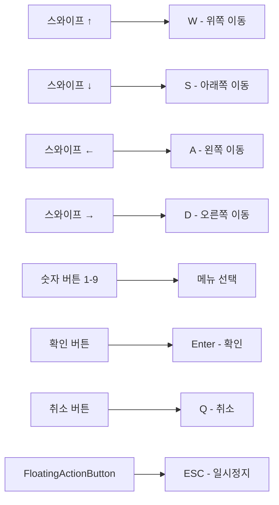

# 📱 모바일 클라이언트 (Flutter) 완전 가이드

Dawn of Stellar의 Flutter 모바일 클라이언트는 터미널 스타일 UI를 모바일에 최적화한 혁신적인 앱입니다.

## 🎨 UI/UX 디자인

### 터미널 테마 디자인
- **레트로 ASCII 스타일**: 원작의 터미널 감성을 모바일에 적응
- **모노스페이스 폰트**: 일관된 텍스트 정렬과 가독성
- **다크 테마**: 검은 배경에 컬러 텍스트 조합
- **"@" 심볼 로고**: 앱 아이콘 및 브랜딩 요소

### 모바일 최적화
- **터치 친화적**: 손가락으로 쉽게 조작 가능한 인터페이스
- **반응형 레이아웃**: 다양한 화면 크기 자동 적응
- **스크롤 최적화**: 긴 텍스트 콘텐츠의 부드러운 스크롤
- **배터리 효율**: 불필요한 애니메이션 최소화

## 🎮 제스처 컨트롤 시스템

### 스와이프 기반 이동
```
↑ 스와이프 업    → W 키 (위쪽 이동)
↓ 스와이프 다운  → S 키 (아래쪽 이동)  
← 스와이프 왼쪽  → A 키 (왼쪽 이동)
→ 스와이프 오른쪽 → D 키 (오른쪽 이동)
```

### 제스처 인식 정확도
- **최소 거리**: 30픽셀 이상 스와이프 시 인식
- **방향 정확도**: 45도 각도 범위 내에서 방향 결정
- **속도 임계값**: 너무 느린 제스처는 무시
- **중복 방지**: 연속 제스처 사이 쿨다운 적용

## 🎛️ 컨트롤 패널 (DraggableScrollableSheet)

### 패널 구조
- **초기 높이**: 화면의 25% (minChildSize: 0.25)
- **최대 높이**: 화면의 75% (maxChildSize: 0.75)
- **드래그**: 위아래로 드래그하여 크기 조절
- **스냅**: 특정 위치에서 자동으로 고정

### 버튼 레이아웃
```
┌─────────────────────────────┐
│  1  │  2  │  3  │  4  │  5  │
├─────────────────────────────┤
│  6  │  7  │  8  │  9  │     │
├─────────────────────────────┤
│ 확인  │ 취소  │  [ESC]      │
└─────────────────────────────┘
```

### 입력 매핑 시스템


## 🔄 디바운싱 & 입력 처리

### 디바운싱 시스템
- **버튼 자동 연타 방지**: 500ms 쿨다운
- **스와이프 중복 방지**: 300ms 간격 제한
- **네트워크 요청**: 1초 이내 중복 요청 차단
- **UI 업데이트**: 불필요한 화면 갱신 방지

### 입력 큐 시스템
- **입력 버퍼**: 빠른 입력을 큐에 저장
- **순차 처리**: 서버 응답 후 다음 입력 처리
- **우선순위**: ESC > 이동 > 메뉴 선택 순
- **타임아웃**: 10초 이상 응답 없으면 재연결

## 🌐 네트워크 통신

### HTTP API 구조
- **베이스 URL**: `http://localhost:5000` (개발용)
- **엔드포인트**:
  - `POST /game/input`: 게임 입력 전송
  - `GET /game/state`: 현재 게임 상태 조회
  - `POST /game/start`: 새 게임 시작
  - `GET /game/save`: 저장된 게임 목록

### 요청/응답 형식
```json
// 입력 요청
{
  "action": "move",
  "direction": "w",
  "timestamp": 1625097600000
}

// 게임 상태 응답
{
  "screen": "게임 화면 텍스트",
  "status": "playing",
  "player_hp": 100,
  "player_mp": 50
}
```

### 오프라인 처리
- **로컬 캐싱**: 최근 게임 상태 로컬 저장
- **재연결 시도**: 3초마다 서버 연결 재시도
- **오프라인 알림**: 연결 상태 실시간 표시
- **데이터 동기화**: 재연결 시 자동 동기화

## 🎨 렌더링 시스템

### RichText 컬러 렌더링
- **ANSI 코드 파싱**: 터미널 색상 코드 해석
- **TextSpan 변환**: Flutter TextSpan으로 변환
- **256색 지원**: 전체 ANSI 256색 팔레트 지원
- **스타일 보존**: 굵기, 기울임 등 스타일 유지

### 텍스트 처리 예시
```dart
// ANSI 색상 코드 파싱
String ansiText = "\033[31m빨간 텍스트\033[0m";
List<TextSpan> spans = parseAnsiText(ansiText);

// RichText 위젯으로 렌더링
RichText(
  text: TextSpan(children: spans),
  style: TextStyle(fontFamily: 'monospace')
)
```

### 스크롤 최적화
- **ListView.builder**: 가상화된 스크롤 리스트
- **자동 스크롤**: 새 텍스트 추가 시 하단으로 자동 이동
- **스크롤 메모리**: 사용자 스크롤 위치 기억
- **성능 최적화**: 화면에 보이는 부분만 렌더링

## 📱 플랫폼별 최적화

### Android 최적화
- **Material Design**: 안드로이드 디자인 가이드라인 준수
- **백 버튼**: 하드웨어 백 버튼 지원
- **알림**: 푸시 알림 시스템 연동
- **권한 관리**: 필요한 권한만 최소 요청

### iOS 최적화  
- **Cupertino 디자인**: iOS 네이티브 느낌의 UI
- **제스처 탐색**: iOS 제스처 시스템 호환
- **다크 모드**: 시스템 다크 모드 자동 감지
- **노치 대응**: iPhone X 이상 노치 영역 처리

## 🔧 개발 환경 설정

### Flutter 환경
```bash
# Flutter 설치 확인
flutter doctor

# 의존성 설치
flutter pub get

# 개발 서버 실행 (핫 리로드)
flutter run

# 빌드 (Android)
flutter build apk

# 빌드 (iOS)
flutter build ios
```

### 주요 의존성
```yaml
dependencies:
  flutter:
    sdk: flutter
  http: ^0.13.5           # HTTP 통신
  shared_preferences: ^2.0.15  # 로컬 저장
  connectivity_plus: ^3.0.2   # 네트워크 상태
  flutter_colorize: ^0.1.0    # 텍스트 색상
```

### 프로젝트 구조
```
flutter_mobile/
├── lib/
│   ├── main.dart              # 앱 엔트리 포인트
│   ├── screens/
│   │   ├── game_screen.dart   # 메인 게임 화면
│   │   └── settings_screen.dart # 설정 화면
│   ├── widgets/
│   │   ├── control_panel.dart # 컨트롤 패널
│   │   ├── game_display.dart  # 게임 화면 표시
│   │   └── input_handler.dart # 입력 처리
│   ├── services/
│   │   ├── api_service.dart   # API 통신
│   │   └── local_storage.dart # 로컬 저장
│   └── utils/
│       ├── ansi_parser.dart   # ANSI 코드 파싱
│       └── debouncer.dart     # 디바운싱 유틸
├── android/                   # Android 네이티브 코드
├── ios/                       # iOS 네이티브 코드
└── pubspec.yaml              # 프로젝트 설정
```

## 🎯 사용자 경험 (UX)

### 직관적 인터페이스
- **학습 곡선**: 터미널 경험 없어도 쉽게 사용
- **일관성**: PC 버전과 동일한 게임플레이
- **피드백**: 모든 입력에 대한 즉각적 반응
- **도움말**: 컨텍스트 기반 도움말 시스템

### 접근성 (Accessibility)
- **글꼴 크기 조정**: 시각 장애인을 위한 큰 글꼴
- **고대비 모드**: 시각 접근성 개선
- **음성 읽기**: TalkBack/VoiceOver 지원
- **터치 영역**: 충분한 터치 타겟 크기

### 성능 최적화
- **메모리 관리**: 메모리 누수 방지
- **배터리 수명**: 백그라운드 활동 최소화
- **네트워크 효율**: 필요한 데이터만 전송
- **응답 속도**: 100ms 이내 UI 반응

## 🔐 보안 및 데이터 보호

### 데이터 보안
- **HTTPS 통신**: 모든 서버 통신 암호화
- **로컬 암호화**: 민감한 로컬 데이터 암호화
- **토큰 관리**: 안전한 인증 토큰 저장
- **세션 관리**: 자동 로그아웃 및 세션 갱신

### 프라이버시
- **최소 데이터**: 필요한 데이터만 수집
- **익명화**: 개인 식별 정보 제거
- **로컬 우선**: 가능한 모든 데이터 로컬 처리
- **투명성**: 데이터 사용 목적 명시

## 📸 스크린샷


## 🚀 향후 계획

### 단기 개발 계획
- **성능 최적화**: 메모리 사용량 최적화
- **UI 개선**: 더 직관적인 인터페이스
- **기능 추가**: PC 버전의 새 기능 동기화
- **버그 수정**: 사용자 피드백 기반 개선

### 장기 개발 계획
- **오프라인 모드**: 인터넷 없이도 플레이 가능
- **클라우드 저장**: 기기간 세이브 데이터 동기화
- **멀티플레이어**: 모바일에서도 멀티플레이
- **AR 지원**: 증강현실 던전 탐험

이 모바일 클라이언트를 통해 언제 어디서나 Dawn of Stellar를 즐길 수 있습니다! 📱✨
