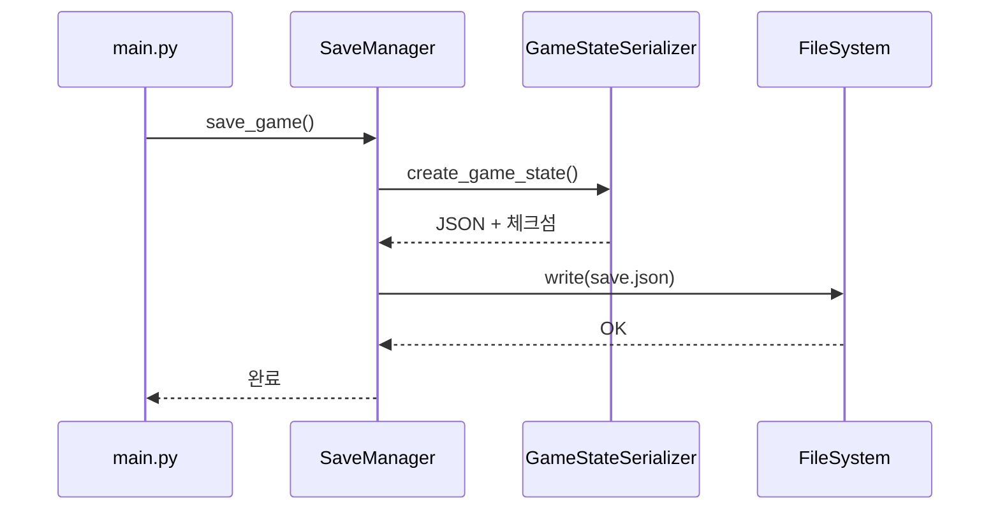

# Save System

- SaveManager + GameStateSerializer
- JSON 저장, 체크섬, 마이그레이션
- 파티/공용 인벤토리/장비/월드 상태/통계/인카운트 정보 포함
- 무결성 패치: 장비 복구 시 Item 객체 기반 인벤토리 추가

## 직렬화 흐름

```mermaid
sequenceDiagram
	participant Main as main.py
	participant SM as SaveManager
	participant GS as GameStateSerializer
	participant FS as FileSystem
	Main->>SM: save_game()
	SM->>GS: create_game_state()
	GS-->>SM: JSON + 체크섬
	SM->>FS: write(save.json)
	FS-->>SM: OK
	SM-->>Main: 완료
```

## 스크린샷

