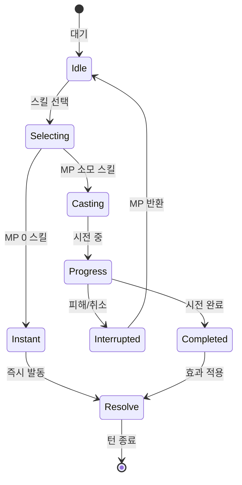

# 🎯 스킬 시스템 & 캐스팅 가이드

Dawn of Stellar의 스킬 시스템은 다양한 타입과 캐스팅 메커니즘을 통해 전략적 깊이를 제공합니다.

## ⚡ 스킬 타입 시스템

### 기본 스킬 타입
1. **BRV_ATTACK** (BRV공격)
   - **MP 비용**: 0 (기본 공격)
   - **효과**: 적의 BRV를 감소시키고 자신의 BRV 증가
   - **시전**: 즉시 시전 (캐스트 타임 없음)
   - **용도**: 기본 공격, BRV 축적

2. **HP_ATTACK** (HP공격)
   - **MP 비용**: 0 (기본 공격)
   - **효과**: 자신의 BRV를 소모하여 적에게 직접 HP 피해
   - **시전**: 즉시 시전
   - **용도**: 마무리 공격, 실제 피해

3. **BRV_HP_ATTACK** (BRV+HP공격)
   - **MP 비용**: 12~20
   - **효과**: BRV 획득과 HP 피해를 동시에
   - **시전**: 캐스트 타임 존재
   - **용도**: 효율적인 복합 공격

4. **ULTIMATE** (궁극기)
   - **MP 비용**: 20~30 (높음)
   - **효과**: 강력한 위력의 특수 공격
   - **시전**: 긴 캐스트 타임 (2~3초)
   - **용도**: 결정적 순간의 강력한 일격

5. **SUPPORT** (지원)
   - **MP 비용**: 8~15
   - **효과**: 회복, 버프, 상태이상 치료
   - **시전**: 중간 캐스트 타임 (1~2초)
   - **용도**: 파티 지원 및 회복

6. **DEBUFF** (디버프)
   - **MP 비용**: 10~18
   - **효과**: 적 약화, 상태이상 부여
   - **시전**: 중간 캐스트 타임 (1.5~2.5초)
   - **용도**: 적 무력화 및 전술적 우위

## 🕐 캐스팅 시스템

### 캐스트 타임 구조
- **즉시 시전**: MP 0 기본 공격 (BRV_ATTACK, HP_ATTACK)
- **단시간**: 0.5~1초 (간단한 스킬)
- **중시간**: 1~2초 (일반적인 전술 스킬)
- **장시간**: 2~3초 (궁극기, 강력한 스킬)

### 캐스팅 메커니즘
1. **시전 시작**: 스킬 선택 시 캐스팅 게이지 표시
2. **진행 표시**: ATB 게이지에 캐스팅 진행률 표시
3. **중단 조건**: 피해를 받거나 취소 시 중단
4. **완료 효과**: 성공 시 스킬 발동 + ATB cast_time만큼 차감
5. **실패 처리**: 중단 시 MP 소모 없음, ATB 유지

### 캐스팅 상태 다이어그램


## 🎭 직업별 특수 시스템

### 🛡️ 전사 - 적응형 전투 시스템
- **6단계 자세**: 공격/방어/균형/광전사/수호자/신속
- **적응형 공격**: 현재 자세에 따라 효과 변화
- **전투 분석**: 상황에 맞는 최적 자세 자동 선택
- **집중도 시스템**: 전사 집중도 5 이상 시 궁극기 사용 가능

### 🏹 궁수 - 조준 시스템
- **조준 포인트**: 공격마다 정확도 증가
- **지원사격**: 턴 종료 시 추가 자동 공격
- **관통사격**: 여러 적에게 동시 피해
- **삼연사**: 연속 3회 공격

### 🗡️ 도적 - 맹독 시스템
- **독 중첩**: 최대 96스택까지 독 누적
- **독 촉진**: HP 공격 시 독 피해 즉시 적용
- **독침**: 기본 독 부여 공격
- **암살**: 독 상태 적에게 추가 피해

### 🌑 암살자 - 그림자 시스템
- **그림자 생성**: 공격 시 그림자 소환
- **그림자 메아리**: 그림자 1개당 추가 피해
- **그림자 처형**: 모든 그림자 소모 강력한 일격
- **그림자 은신**: 그림자를 통한 회피 증가

### 🎵 바드 - 음표 시스템
- **음표 중첩**: 파티 버프 효과 누적
- **사기 시스템**: 파티 전체 능력치 증가
- **음파 공격**: 음악을 통한 범위 공격
- **영혼의 노래**: 강력한 파티 힐링

### 🔧 기계공학자 - 장비 조작 시스템
- **레이저 사격**: 정밀한 원거리 공격
- **메가 레이저**: 강력한 범위 공격
- **장비 분석**: 적 장비 약점 분석
- **기계 조작**: 던전 내 기계 장치 활용

### 🌙 무당 - 영혼 시스템
- **영혼 타격**: 마법 방어 무시 공격
- **영혼 분리**: 적의 영혼을 분리하여 무력화
- **영혼 치유**: 강력한 정신계 회복
- **액막이**: 부정적 효과 방어

### ⚡ 광전사 - 분노 시스템
- **분노 축적**: 피해를 받을수록 분노 증가 (최대 100스택)
- **분노 폭발**: 분노를 소모한 강력한 공격
- **광전사 특성**: 잃은 HP 25%만큼 공격력 증가 (최대 75%)
- **최후의 광기**: 체력이 낮을수록 더 강해짐

## 🎯 스킬 선택 전략

### 전투 상황별 스킬 사용
1. **전투 초반**: BRV 공격으로 BRV 축적
2. **중반**: 전술 스킬로 우위 확보
3. **마무리**: HP 공격으로 실제 피해
4. **위기 상황**: 지원 스킬로 회복/버프
5. **결정적 순간**: 궁극기로 강력한 일격

### MP 관리 전략
- **MP 0 스킬**: 기본 공격은 언제든 사용 가능
- **저MP 스킬** (8~12): 자주 사용하는 전술 스킬
- **고MP 스킬** (20+): 중요한 순간에만 사용
- **MP 회복**: 턴마다 자동 회복, MP 포션 활용

### 캐스팅 타이밍
- **안전한 상황**: 긴 캐스트 타임 스킬 사용
- **위험한 상황**: 즉시 시전 스킬 위주
- **적 캐스팅 중**: 공격으로 적 캐스팅 중단
- **아군 보호**: 탱커가 어그로 끌 때 캐스팅

## 🛠️ 스킬 데이터 구조

### 스킬 정의 예시
```python
{
    "name": "적응형_방패강타",
    "type": SkillType.BRV_ATTACK,
    "mp_cost": 0,
    "cast_time": 0.0,
    "target_type": TargetType.SINGLE_ENEMY,
    "element": ElementType.NEUTRAL,
    "description": "[BRV:100] [6단계 적응형] [물리] - 현재 자세에 따라 효과가 변하는 기본 공격"
}
```

### 대상 타입 (TargetType)
- **SELF**: 자신
- **SINGLE_ALLY**: 아군 1명
- **ALL_ALLIES**: 아군 전체
- **SINGLE_ENEMY**: 적 1명
- **ALL_ENEMIES**: 적 전체
- **DEAD_ALLY**: 죽은 아군 1명
- **BATTLEFIELD**: 전장 (필드 스킬)
- **ANY_SINGLE**: 아무나 1명

### 원소 타입 (ElementType)
- **NEUTRAL**: 무속성
- **FIRE**: 화염
- **ICE**: 냉기
- **LIGHTNING**: 번개
- **EARTH**: 대지
- **WIND**: 바람
- **WATER**: 물
- **LIGHT**: 빛
- **DARK**: 어둠
- **POISON**: 독

## 🔧 특수 효과 시스템

### 상태 효과 타입
```python
class StatusType(Enum):
    # 긍정적 효과
    BLESS = "축복"
    REGEN = "재생"
    ATTACK_UP = "공격력증가"
    DEFENSE_UP = "방어력증가"
    SPEED_UP = "속도증가"
    
    # 부정적 효과
    POISON = "독"
    BURN = "화상"
    FREEZE = "빙결"
    PARALYSIS = "마비"
    CURSE = "저주"
    
    # 특수 상태
    WARRIOR_STANCE = "전사자세"
    SHADOW_ECHO = "그림자메아리"
    AIM_POINT = "조준포인트"
    POISON_STACK = "독중첩"
```

### 효과 지속 시간
- **즉시**: 한 번만 적용되는 효과
- **단기** (1~3턴): 일시적 버프/디버프
- **중기** (3~5턴): 전술적 상태 변화
- **장기** (5+턴): 전략적 상태 효과
- **영구**: 전투 종료까지 지속

## 📊 스킬 밸런스

### 밸런스 원칙
- **MP 0 스킬**: 위력 적당, 언제든 사용 가능
- **저MP 스킬**: 실용적, 자주 사용하는 전술
- **고MP 스킬**: 강력하지만 제한적 사용
- **궁극기**: 매우 강력하지만 높은 비용과 긴 캐스팅

### 직업별 특성
- **물리 직업**: 높은 직접 피해, 빠른 행동
- **마법 직업**: 다양한 효과, 높은 MP 소모
- **지원 직업**: 파티 버프, 회복 특화
- **특수 직업**: 고유 메커니즘, 독창적 전술

## 🎮 UI 및 조작

### 스킬 선택 UI
- **숫자 키 1-9**: 스킬 선택
- **Q 키**: 취소/뒤로가기
- **Enter**: 확인
- **H 키**: 도움말

### 캐스팅 표시
- **진행률 바**: 캐스팅 진행 상태
- **남은 시간**: 완료까지 남은 시간
- **중단 가능**: "피해 시 중단됨" 경고
- **색상 구분**: 스킬 타입별 색상

### 스킬 정보 표시
- **이름**: 스킬 이름 및 타입
- **MP 비용**: 필요한 MP 양
- **설명**: 효과 및 특성 설명
- **대상**: 타겟 범위 표시

## 📸 스크린샷


이 스킬 시스템을 통해 각 직업의 고유한 특성을 살려 전략적인 전투를 즐길 수 있습니다!
